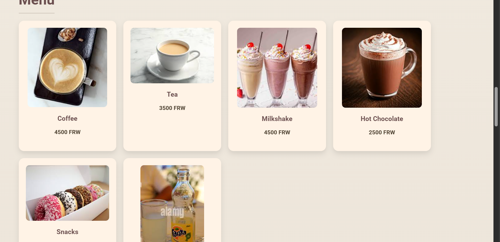

# ☕ Jane’s Coffee Shop Website

Welcome to **Jane’s Coffee Shop**, a modern, responsive, and elegant web design project that showcases a community-based coffee brand.  
This project combines **HTML5** and **CSS3** to deliver a visually engaging and interactive experience that reflects the warm and creative atmosphere of a real coffee shop.

---

## 🌟 Project Overview

**Jane’s Coffee Shop** is more than just a café.It’s a **community hub** that celebrates creativity through coffee, art, and talent.  
The website aims to:
- Present the shop’s **mission and values**.
- Showcase its **menu**, **services**, and **innovation**.
- Provide an **interactive ordering form**.
- Connect visitors to **social media platforms**.

The website is fully static, designed with **smooth animations**, **responsive grids**, and **modern aesthetics**.

---

## 🖥️ Features

### 🎨 Design
- Warm coffee-inspired gradient background.  
- Floating **animated coffee beans** for visual engagement.  
- Elegant **Pacifico** and **Roboto** Google Fonts combination.  
- Hover and transition effects on images, headers, and buttons.  

### 📋 Sections
1. **Header** : Hero banner with logo and slogan.  
2. **Background** : A brief introduction to the coffee shop.  
3. **Services** : Details on offerings such as mentoring, deliveries, and community events.  
4. **Innovation** : Description of the shop’s social and business values.  
5. **Menu** : Product cards displaying drinks and snacks with prices.  
6. **Order Form** : Simple form for customers to request deliveries.  
7. **Gallery** : Image grid showing shop interiors, customers, and coffee-making.  
8. **Social Media** : Contact links for email, Instagram, Facebook, and phone.  
9. **Footer** : Closing message and logo.  

---

## 🧱 Technologies Used

| Technology | Purpose |
|-------------|----------|
| **HTML5** | Structure and semantic content |
| **CSS3** | Styling, animations, and responsive layout |
| **Google Fonts** | Typography (Pacifico, Roboto) |
| **Custom Images** | Visual branding and engagement |

---

## 📂 Folder Structure

```plaintext
Jane-Coffee-Shop/
│
├── index.html                 # Main HTML file
│
├── images/                    # Folder containing all images
│   ├── logo.jpg
│   ├── coffee.jpg
│   ├── tea.jpg
│   ├── milkshake.jpg
│   ├── hotchocolate.jpg
│   ├── snacks.jpg
│   ├── fanta.jpg
│   ├── interior.jpg
│   ├── customersexperience.jpg
│   ├── coffeepreparation.jpg
│   ├── coffeeshopoverview.png
│   └── coffeeshop.jpg
│
└── README.md                  # Project documentation file
````

---

## 🚀 How to Run the Project

1. **Clone or Download** this repository:

   ```bash
   git clone https://github.com/janebatakariza-hue/coffee-shop.git
   ```
2. Open the folder in your code editor.
3. Run the project by opening `index.html` in your browser.
   *(You can simply double-click the file or use a live server extension in VS Code for a better experience.)*

---

## 📱 Responsiveness

The layout automatically adjusts to various screen sizes using:

* **CSS Grid** for flexible product and gallery sections.
* **Responsive font sizes**.
* **Viewport-based design scaling**.

---

## 💡 Future Improvements

* Add JavaScript functionality for real-time order confirmation.
* Integrate backend (e.g., Firebase or Node.js) for storing order requests.
* Include an interactive map for location.
* Add a customer review carousel.

---

## 📸 Preview



---

## 📧 Contact

**Jane’s Coffee Shop**
📩 Email: [janescoffeeshop@gmail.com](mailto:janescoffeeshop@gmail.com)
📸 Instagram: [@janescoffeeshop40](https://instagram.com/janescoffeeshop40)
📘 Facebook: [Jane’s Coffee Shop](https://facebook.com/janescoffeeshop40)
📞 Phone: +250 788 000 000

---

## ❤️ Acknowledgements

Designed and developed by **Jane**.
Built with passion for coffee, creativity, and community.


